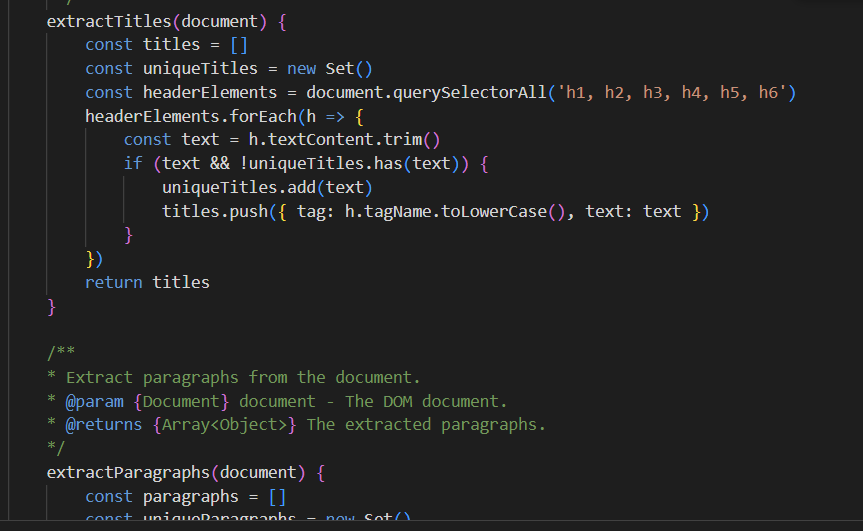
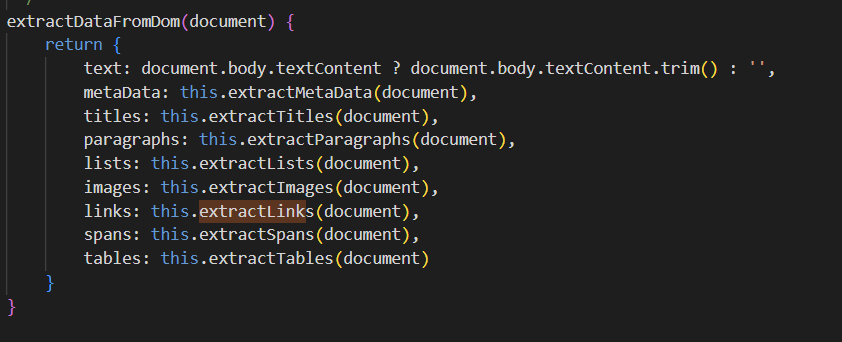
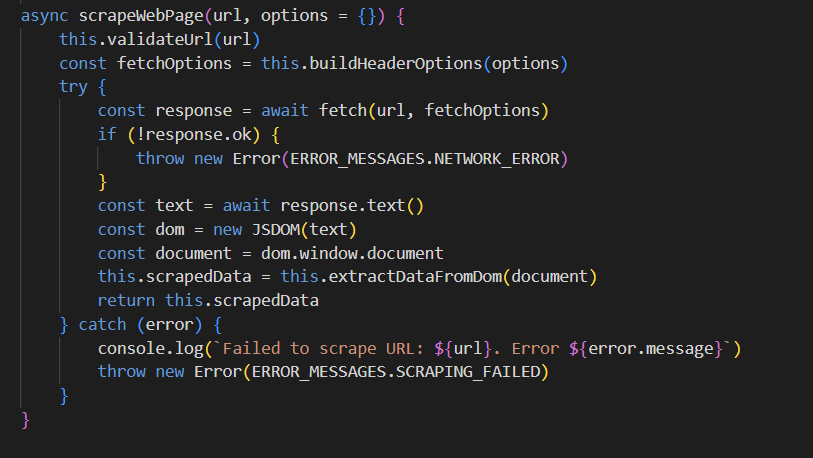
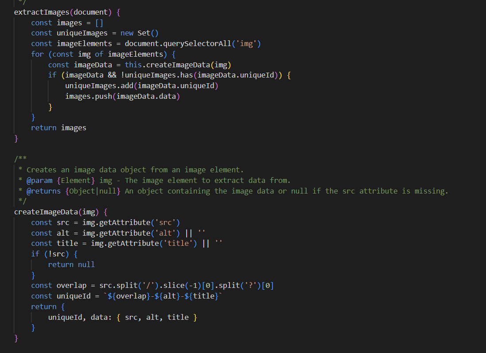
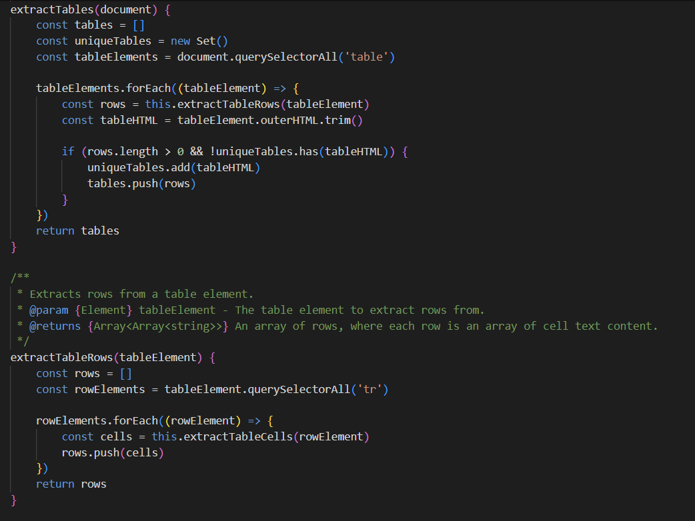
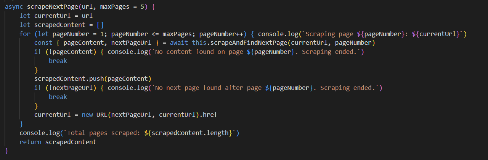
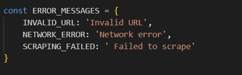
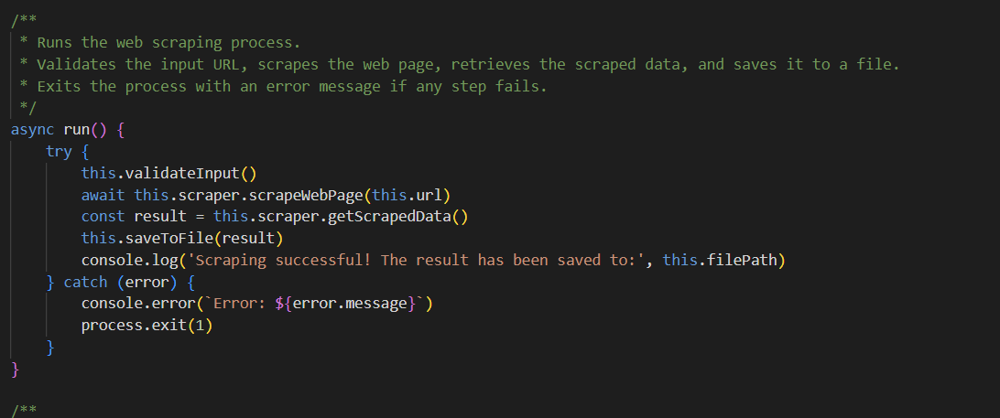
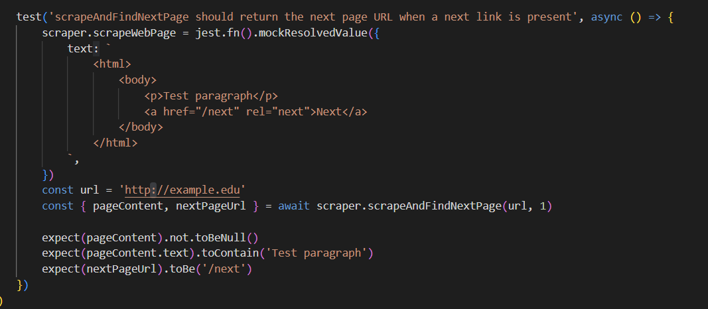
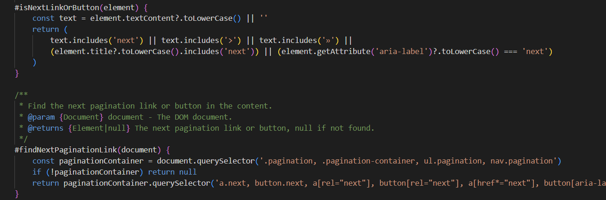

# Reflection
The project provided me alot of insight into the way that i write and develop my code. As i began comparing my code to that of the ideal version described in clean code i realised how much i lack or am less aware of. Once you read the chapters you realise how much you utilise and develop your code to align with it, even in just a small way, like reducing coupling in chapter 8 or helper error handling functions in chapter 7. It was interesting to see how much you could improve even in small ways from Clean Code. It was a very positive experience to actively learn about how to improve the way we write code, something i feel that we have not done so much of as we are mainly focusing on a solution. The end result in L3 was such an improvement because i could break the functions into smaller manageable and readable parts which also made testing easier.

## Kapitel 2 Names
In my reflection on L2, I realized that I overuse the word get in function names like getMetadata and getTitles for extracting DOM elements. According to Clean Code principles using precise names is important and the term get can be misunderstood, especially since it might imply a getter method rather than an action like scraping or extracting data. As a result I renamed my functions, changing getMETHOD to extractMETHOD, resulting in names like extractMetaData and extractTitles. This change better communicates the purpose of each method, making it clear that these functions are extracting specific HTML elements from the DOM. Better communicating the functions responsibility. I also renamed the main scraping method to scrapeWebPage to indicate its purpose. I wanted each function to do just one thing but I ended up with functions like findAndScrapeNextPage and scrapeNextPage and the names were so similar that it got confusing. Even though they are doing different things, it felt like i might be complicating things. My main focus was on the Intention-Revealing Names aspect of the code so that functions would indicates their intention without additional explanation. It was insightful to see how simply naming could improve the readability of the code.  

## Kapitel 3 Functions
There were alot of improvements to be made based on the functions chapter that i thought would be most challenging as my functions were very long. I was able to seperate my methods into much shorter ones, using helper methods and it was interesting to see how easy it was to break them into three of four functions to align with single responsiblity as is discussed in clean code. ScrapeWebPage could be seperated into helper functions for formatting, headers, user agents and a main function which significantly reduced length as it was my longest. I also tried to break down and work on the multiple page scraping aspect and the result was many helper functions to handle specific elements, like pagination, next buttons, and links, which did make my longest functions shorter. However, due to variety in next page buttons and html structure differing on various websites, its difficult to find the next page as it is often hidden in divs, in classes, and lists. This is unfortunate but the universality of navigation is perhaps too much to conquer for now. In L2 my functions were very repetive and so i tried to follow Do Not Repeat yourself more, i feel that i acheived this as my extract methods are shorter and broken into helper functions that make things much clearer and easier to understand. Overall aligning the code with Clean code functions was difficult as i struggled to find a balance between short and understandable.

## Kapitel 4 Comments
This chapter talks alot about how code should be self explanatory so that comments arnt as necessary. This was a key motivation in shorting my functions because they required less comments to be understood. I tied to make the function names and structure clear enough that extra explanations were not needed. For example, the extractImages and createImageData functions are simple and direct. They each have a single purpose, to focuses on pulling images and the other organizes the data. Forcing myself to write the functions in a way that communicated their logic. I think this chapter aligns well with the code because the names are very desrciptive. 

## Kapitel 5 Formatting
I think i had a good structure and format in L2 as the code follows a linear narrative, but because there are so many more functions in L3 it became more important to focus on the format. I focused on having methods that fit together close together. For example, extractTables is responsible for locating and filtering tables, extractTableRow pulls out the rows, and extractTableCell handles individual cells. This flow makes it easier to understand how everything fits together. Nesting was one of my biggest problems and in L2 there were a lot of if-statements and loops inside one another, which made it hard to follow the logic. In L3 i reduced indentation and made it more readable.

## Kapitel 6  Objects and Data Structures
In this chapter i focused on how i structured and managed data which is a large part of this project. By returning objects between helper functions i could keep better track of the data and it was easier to modify. Using objects to pass multiple arguments into scrapeNextPage also aligned with the Law of Demeter beacuse i could keep the data encapsulated and reduce dependencies between different parts of the code.

## Kapitel 7 Error Handling
I worked on developing my error handling in L3 more than in L2. I moved my error handling for scrapeWebPage into constants outside the class to keep error logic seperate from the main functionality and focused on logging. This way simliar error handling can be used throughout the class. I also used try catch block from L2 to manage errors as this was the part of my code most likley to throw errors.

## Kapitel 8 Bounderies 
I worked on bounderies within the module but also the bounderies between the console line app and the module. It was challenging to ensure that there were not dependecies between the app and the module, something that i did notice i had issue with resulting in some methods being reworked or removed. I tried to manage the dependencies by reducing coupling and make the code more flexible in case i want to use it in another project. There was not alot I could neccessarily practially use from this chapter such as interfaces but i still feel it gave me alot in regards to reducing dependencies between methods and classes.

## Kapitel 9 Unit Tests
This chapter provided alot of insight into testing which was really interesting. Because of my code structure each method is easy to test allowing my tests to serve as a form of documentation in regards to functionality. The tests are readible and fast and it was easy to think of failing situations such as invalid URL. I wrote and developed my test rapports to align with Arrange-Act-Assert, creating the conditions in the test, documenting the behaviour i wanted to test and verifying the outcome to the expected result. This chapter was very insightful in regards to Test Driven Development and i want to work on this in my code in the future. 

## Kapitel 10 Classes
My class for the webscraper does follow a single responsiblity and high cohesion but perhaps due to the logic of finding the next page, it tries to do too much and becomes too branched out. I have managed to keep my functions small but i should have focused on keeping classes small. The CLI class is small and simple but the webscraper class could be seperated into two classes. At the same time the coupling is low between these two classes and my use of encapsulation in the webscraper class aligns with the clean code principles for classes. 

## Kapitel 11 Systems

Alignment: The code is modular, making it easy to change one part without affecting others:
If the logic for a function or method changes the methods dependant on it can be modified accordingly tex finding the next page changes, #findNextPage can be modified without affecting scrapeNextPage.
If the scraping mechanism needs to be adjusted, scrapeSinglePage can be updated independently.
