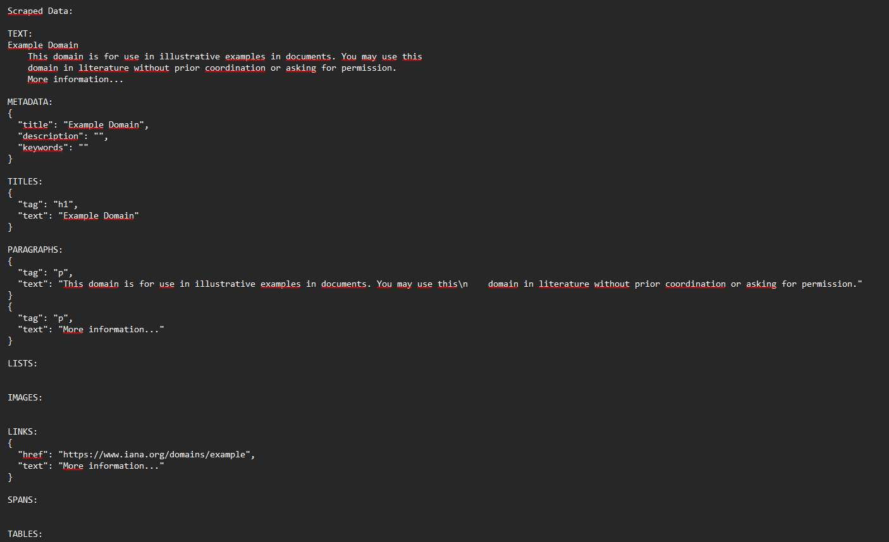
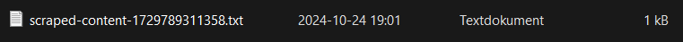

# Test Rapport

## Manual Test Cases

| Test   | Description                      | status|
|--------|----------------------------------|-------|
| Test 1 | URL Validation in CLI            | Pass  |
|--------|----------------------------------|-------|
| Test 2 | URL validation with invalid URL  | Pass  |
|--------|----------------------------------|-------|
| Test 3 | scraped content formatted        | Pass  |
|        | correctly                        |       |
|--------|----------------------------------|-------|
| Test 4 | CLI runs scraper and saves ouput | Pass  |
|--------|----------------------------------|-------|

### Test Case 1: Validate Input URL
Description: Ensure that the CLI validates the input URL correctly.
Steps:
1. Run the CLI without providing a URL.
2. Observe the output.
Expected Result: The CLI should display an error message: "Please enter a URL to scrape."
Result:

### Test Case 2: Validate URL Format
Description: Ensure that the CLI validates the format of the input URL.
Steps:
1. Run the CLI with an invalid URL format (e.g., invalid-url).
1. Observe the output.
Expected Result: The CLI should display an error message: "Invalid URL."
Result:

### Test Case 3: Format Result
Description: Ensure that the CLI formats the scraped result correctly.
Steps:
1. Create an mock output from scraped content. (see manualTest.js)
2. Call the formatResult method with the sample result. (node manualTest.js)
3. Observe the formatted output.
Expected Result: The formatted output should contain the keys in uppercase and the values properly formatted.
Result:

### Test Case 4: Run Scraper and Save Result
Description: Ensure that the CLI runs the scraper and saves the result.
Steps:
1. Run the CLI with a valid URL: https://example.edu/
2. Observe the output and file operations.
Expected Result: The CLI should scrape the web page, format the result, and save it to a file.
Result:

