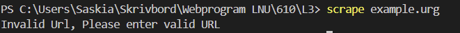

# Test Rapport

## Manual Test Cases

### Test Case 1: Validate Input URL
Description: Ensure that the CLI validates the input URL correctly.
Steps:
Run the CLI without providing a URL.
Observe the output.
Expected Result: The CLI should display an error message: "Please enter a URL to scrape."

### Test Case 2: Validate URL Format
Description: Ensure that the CLI validates the format of the input URL.
Steps:
Run the CLI with an invalid URL format (e.g., invalid-url).
Observe the output.
Expected Result: The CLI should display an error message: "Invalid URL."

